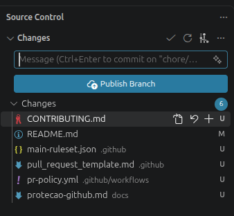
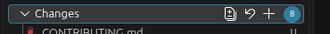
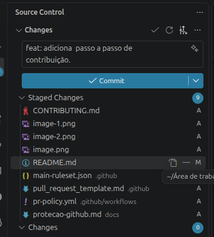

# Como participar do projeto

A regra é simples: faça sua mudança em uma área separada e peça para outra
pessoa conferir antes de colocar na versão principal do projeto.

## O que esses nomes significam?

- **Repositório:** a pasta do projeto que compartilhamos pelo GitHub.
- **`main`:** a versão principal do projeto, que todo mundo usa como base.
- **Branch:** uma linha de trabalho separada. Você pode fazer mudanças nela
  sem mudar a `main`.
- **Commit:** um registro das suas mudanças, com uma mensagem dizendo o que fez.
- **Push:** enviar os commits do seu computador para o GitHub.
- **Pull request (PR):** um pedido para colocar suas mudanças na `main`.
  É onde outra pessoa confere seu trabalho e pode pedir ajustes.
- **Merge:** juntar as mudanças aprovadas à versão principal.

## 1. Combine o que você vai fazer

Avise o grupo antes de começar. Por exemplo: “Vou fazer a contagem de pontos”.
Assim, duas pessoas não fazem a mesma tarefa sem saber.

Tente resolver uma tarefa por vez. Se quiser mudar a linguagem, as ferramentas
ou adicionar uma biblioteca ao projeto, converse com o grupo primeiro.

## 2. Prepare o projeto no seu computador

Se ainda não baixou o projeto, abra o terminal e execute:

```bash
git clone https://github.com/ElisaAndradedeJesus/ProjetoMD.git
cd ProjetoMD
```

Se já baixou, abra a pasta do projeto no VS Code e vá em **Terminal → New Terminal**
(ou **Novo Terminal**). Não precisa baixar de novo.

## 3. Crie sua área de trabalho

Antes de começar uma tarefa nova, execute um comando por vez:

```bash
git switch main
```

Esse comando seleciona a versão principal no seu computador.

```bash
git pull --ff-only origin main
```

Esse comando baixa as novidades da versão principal que estão no GitHub.

```bash
git switch -c sua-branch
```

Esse comando cria e seleciona sua branch. Troque `sua-branch`
por um nome relacionado à sua tarefa, sem espaços nem acentos.

**Se algum comando der erro, pare e peça ajuda ao grupo, enviando a mensagem
que apareceu.** Se já tiver mudanças de outra tarefa, termine de enviá-las
antes de começar esta sequência.

## 4. Faça e confira sua mudança

Edite os arquivos e confira se o que você fez funciona.
Se usou IA, leia o código e entenda o que ele faz antes de enviar.

Não envie senhas, chaves de acesso ou dados pessoais nos arquivos.

## 5. Salve e envie para o GitHub

Veja quais arquivos você mudou:

<p align="center">
  
</p>

Escolha os arquivos que quer incluir clicando no `+`:

<p align="center">
  
</p>

Registre a mudança com uma mensagem curta:

<p align="center">
  
</p>

Envie para o GitHub. Use o mesmo nome de branch que criou no passo 3:

```bash
git push -u origin sua-branch
```

Ou clique no botão azul `Push` ou `Publish Branch`.

## 6. Peça para alguém conferir

1. Abra o repositório no GitHub.
2. Clique em **Compare & pull request**, se esse botão aparecer. Você também
   pode ir em **Pull requests → New pull request**.
3. Em **base**, escolha `main`. Em **compare**, escolha sua branch.
4. Escreva um título seguindo os exemplos abaixo.
5. Preencha a descrição: o que mudou e como você conferiu se funciona.
6. Clique em **Create pull request** e peça a alguém do grupo para revisar.

### Como escrever o título?

Use uma palavra da tabela, dois-pontos, um espaço e uma descrição curta:

| O que você fez | Exemplo de título |
| --- | --- |
| Adicionou algo novo | `feat: adiciona contagem de pontos` |
| Corrigiu um erro | `fix: corrige pontuação da segunda rodada` |
| Mudou textos ou instruções | `docs: explica como abrir o jogo` |
| Organizou ou configurou o projeto | `chore: organiza as pastas do projeto` |

O título deve ter até 100 caracteres. Use esse mesmo formato nas mensagens
que escreve ao fazer um commit.

Há outros tipos aceitos para tarefas específicas: `style`, `refactor`, `perf`,
`test`, `build`, `ci` e `revert`. Para começar, os exemplos da tabela bastam.

## 7. Espere a revisão e faça os ajustes

O GitHub vai conferir automaticamente o título do pedido. Essa verificação
se chama `pr-policy`. Se ela falhar, confira o título e edite pelo botão
**Edit**, ao lado dele. O GitHub fará a verificação de novo.

**Essa verificação ainda não testa se o programa funciona.** Quem fez a mudança
precisa testá-la, e quem revisa precisa conferir o trabalho.

Se pedirem ajustes, edite os arquivos na mesma branch e repita os comandos
`git add`, `git commit` e `git push`. As mudanças aparecem no mesmo pedido;
não precisa abrir outro. Depois de novas mudanças, será preciso aprovar de novo.

Se o GitHub avisar que há conflitos ou que a branch precisa ser atualizada,
peça ajuda ao grupo antes de continuar.

## 8. Coloque a mudança aprovada na versão principal

Outra pessoa com permissão para colaborar no repositório precisa aprovar seu
pedido. Você não pode aprovar o próprio trabalho.

Quando a verificação passar, a revisão estiver aprovada e os comentários
estiverem resolvidos, use **Squash and merge**. Esse botão junta os commits do
pedido em um único registro na `main`. Confira se a mensagem desse registro
é o título do pedido e confirme.

Na próxima tarefa, volte ao passo 3 e crie outra branch.

## Para quem vai revisar

Leia as mudanças e os passos de teste. Se algo não estiver claro, pergunte no
pedido. Para aprovar, abra **Files changed → Review changes → Approve → Submit
review**. Se precisar de correção, escolha **Request changes** e explique o motivo.

Quando a mudança envolver um algoritmo, conversem também sobre quanto tempo
e memória ele usa, principalmente quando a quantidade de dados aumenta.

## Combinados do grupo

- Não envie mudanças diretamente para a `main` e não apague essa branch.
- Não use comandos com `--force` para tentar resolver erros. Peça ajuda.
- Faça pedidos pequenos, com uma tarefa de cada vez.
- Confira seu trabalho antes de pedir revisão.

Esses bloqueios precisam ser ativados por quem administra o repositório.
O [guia de configuração](docs/protecao-github.md) explica essa parte.
